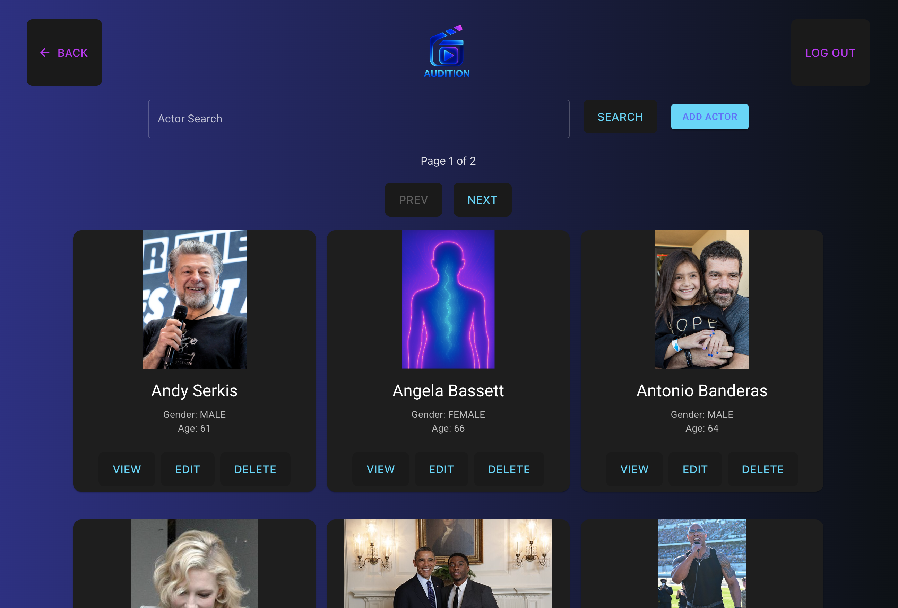
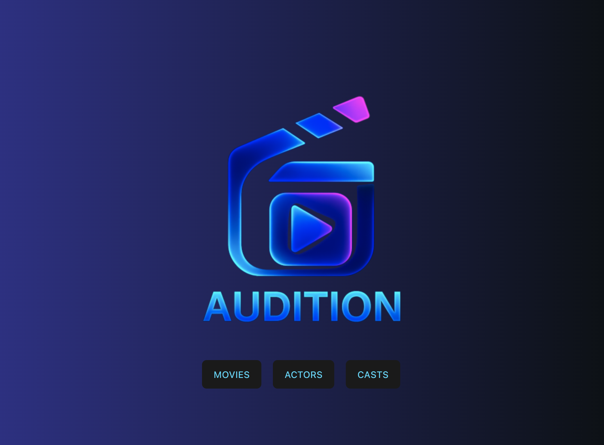
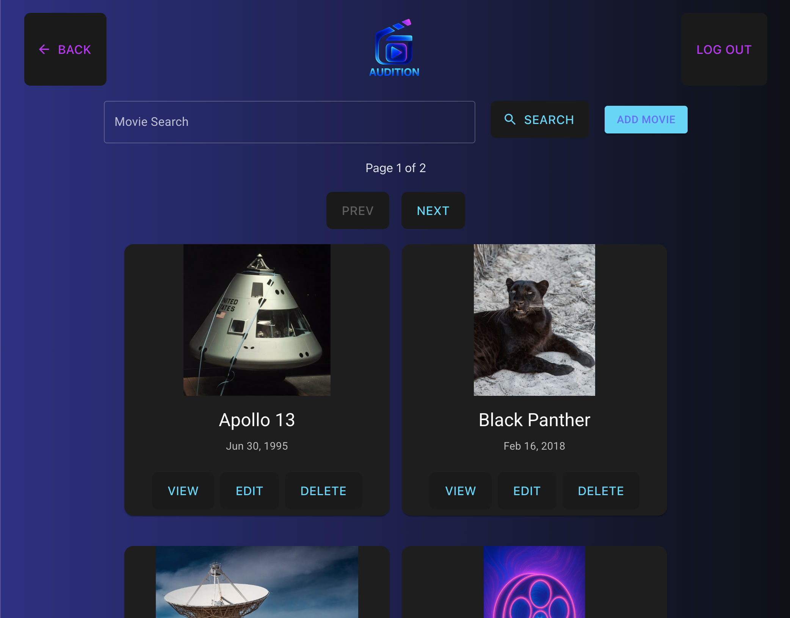
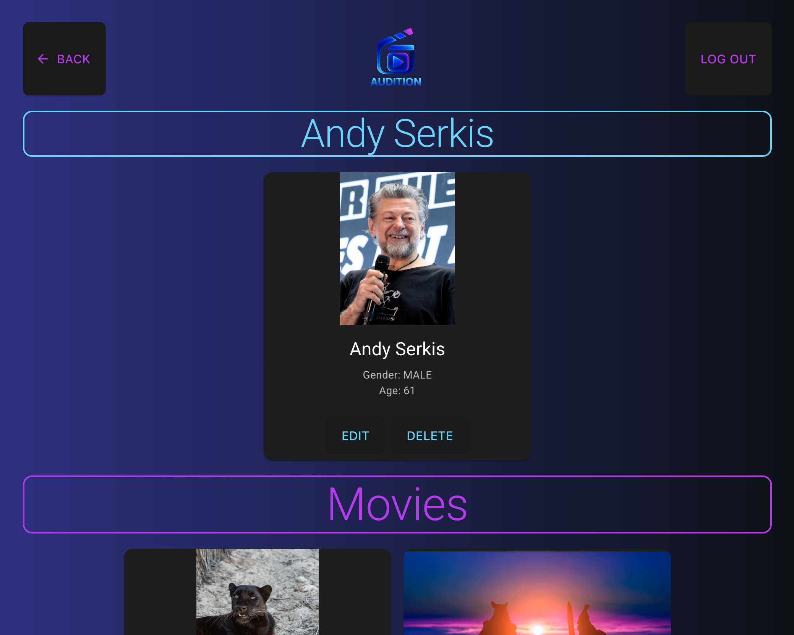
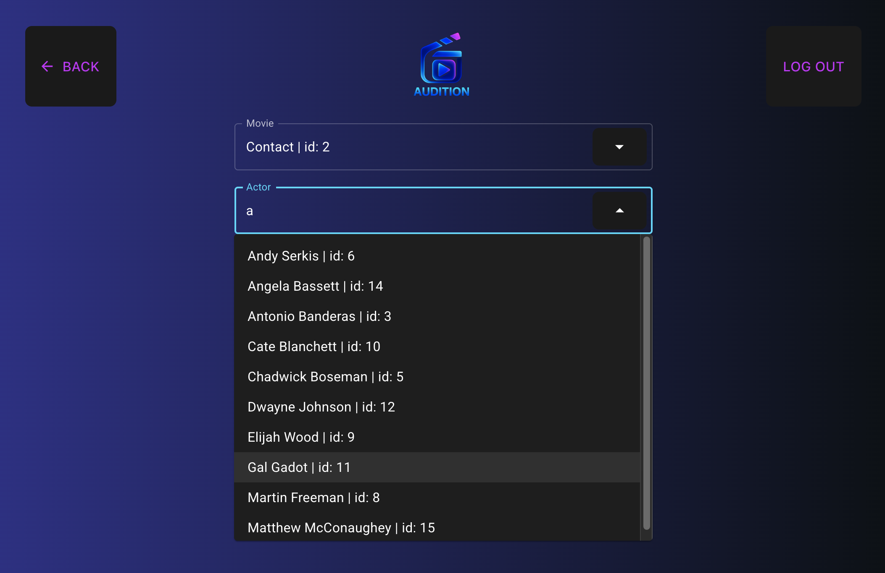

# Audition: A Movie Casting App for Casting Agencies
Capstone project for the Udacity Full Stack Web Developer Nanodegree




Initial backend code forked from https://github.com/udacity/render-cloud-example. Everything was pretty heavily modified after that.

Frontend: React + Vite + TypeScript + Material UI + Formik

Backend: Python with Flask + SQLAlchemy + Alembic

Database: PostgreSQL 16

Auth: Auth0 with Role-Based Access Control (RBAC)

Hosting: AWS RDS (PostgresQL DB), ECS Fargate (Flask API app), and S3 Static-Site Hosting (React Frontend).

See the READMEs in the `frontend` and `backend` directory for specific information on running the Frontend and Backend.

## A note on unit tests
Testing this exhaustively would double the delivery time of this project for the Udacity course, but I have mostly tested the backend API with unittest.
- See the `backend/tests/movies_tests.py` test file for an example of patching modules with the patch decorator, and validating that permissions checks are applied to the appropriate endpoint
- The `actors_tests.py` and `casting_tests.py` files simply bypass the permissions checks, but in production I would test these just like the movies tests.
- Unit testing the Frontend is out-of-scope for the Udacity project, but normally I would do that with Vitest and (for critical flows) Cypress.

## Postman Tests
There is a Postman Collection included in the `/backend` directory that tests all RBAC roles and actions on the API. You will need to set up your authorization tokens for each RBAC role to use the collection. See the backend README for details.

## AWS Architecture Overview
- API Entrypoint at an Application Load Balancer via a custom domain with an A Record alias pointing at the ALB in Route53.
- ALB connects to the ECS tasks running in Fargate in the private subnets of a new (small!) VPC.
- ECS task(s) connect to the PostgresQL DB in RDS.
- EC2 Bastion Host is available to SSH into the EC2 Instance and interact with the RDS database from the terminal.
- RDS deployment is single instance with no backups (just for test projects, not for prod)
- Communication between ECS, RDS, and ALB is inside the VPC and over HTTP/TCP (for production, you'd probably want SSL even inside the VPC)
- ECS and RDS are hosted in private subnets, and all communication from ECS to AWS Services (logs, S3, etc.) happens over VPC Endpoints with Private DNS enabled. This means that no traffic goes from ECS to AWS Services over the public internet. It stays within the VPC. It also does not travel through NAT Gateways (which makes container image pulls from S3, through ECR, free).

In Summary: this template generates a small VPC with what I consider to be basic best practices (logs enabled, entrypoint is an ALB, services and DB are in private subnets and isolated from the public internet).


## Requirements to deploy on AWS
### Prerequisites
- A registered domain name in Route53 to use in your Application Load Balancer SSL certificate(s) and for hosting the Frontend on S3.
- (after deployment) Create an A record alias to the API's ALB at `api.your-domain.example`.
- A private ECR repository named: "capstone-repository" containing your app image with a `:latest` tag.
- An open 10.16.0.0/24 CIDR block among your AWS VPCs.
- Two SSL Certificates from Amazon Certificate Manager (one for api.{YOUR_DOMAIN}, one for Frontend).
- An S3 Bucket to hold the initial CloudFormation template
- Upload the initial CloudFormation template to S3. Example: `aws s3 cp CapstoneTemplate-template.yaml s3://{YOUR_BUCKET_NAME}/CapstoneTemplate-template.yaml`
- DNS records that point to the API's Application Load Balancer from your custom domain.
- AWS Systems Manager Parameter Store SecureString values for the following environment variables (e.g. DATABASE_URL has to be included to run the API on ECS):
    - DBUsername
    - DBPassword
    - DATABASE_URL
    - 
- Everything else is included in the CloudFormation template, provided that you pass in the correct environment variables and parameters when running `aws cloudformation create-stack` (I recommend doing that through Parameter Store, but this is an example app so I feed some things in through the cloudformation terminal command as Parameters below).
### Steps
(WIP)
- Deploy the initial CloudFormation Stack to bootstrap necessary resources and get the services, etc. running. Example CLI command:
```bash
aws cloudformation create-stack --stack-name capstone-stack --template-url https://{YOUR_BUCKET_NAME}.s3.amazonaws.com/CapstoneTemplate-template.yaml --parameters ParameterKey=MyUsername,ParameterValue=admin ParameterKey=MyIPAddressCIDR,ParameterValue=0.0.0.0/32 ParameterKey=DBUsername,ParameterValue=postgres ParameterKey=DBPassword,ParameterValue="SUPERsecretPASSWORD" --capabilities CAPABILITY_NAMED_IAM --profile default
```
- Automated builds with CodeBuild are out-of-scope for this project.

## Considerations for the CloudFormation template
- The VPC is deliberately kept small for this project (/24 CIDR, less than 256 available IPs). You should probably use a larger VPC in production.
- SSL communication with the DB is not turned on. I'd recommend turning that on in production.
- There is no Replica or Backup for the PostgresQL DB. You would want those in a production app.
- SSL Terminates at the ALB when calling the API, then HTTP is used to go from the ALB to the API app. In production, you'd probably want to encrypt this.
- An EC2 Bastion Host is provided in order to access the PostgresQL DB in RDS from your local terminal. The KeyPair to access it is created by the CFN template. You can find the private key in your account in AWS Systems Manager Parameter Store after running the template at `/ec2/keypair/key-05abb699beEXAMPLE`
    - Download the Private Key and store it in a .pem file
    - Connect to the EC2 Bastion Host by running the following command:
    - `ssh -i location_of_pem_file ec2-user@ec2-instance-public-dns-name`
- NAT Gateways are used for all traffic outbound to the public internet (best practice).
- Default KMS keys are used for all encryption (PostgresQL, ACM, Parameter Store secrets).
- This AWS architecture is relatively cheap, but there are costs associated with running this stack. Namely:
    - NAT Gateways are in each of the two public subnets in the VPC
    - VPC Endpoints are used with Private DNS enabled to enable access to AWS Services from inside the private subnets that the ECS Fargate service and API app containers run in. This is more secure and preferable to running traffic in the private subnets out to AWS Services over NAT Gateways and the public internet, and calls through the S3 Gateway VPC Endpoint to fetch ECR images are free. However, there are a lot of VPC Endpoints for all the services used (KMS, Systems Manager Parameter Store, S3, ECR, etc.), and each of those has an ENIs in every private subnet, 
    - Enhanced Monitoring is enabled on the RDS instance.
    - There is an ALB in front of the ECS Fargate tasks that run the API, and it has Elastic Network Interfaces in each of the two public subnets of the VPC.
    - RDS has a cost since it is a managed service, and since I wanted to set this up with RDS (best practice) instead of just putting PostgresQL on an EC2 Instance.

## Screenshots



