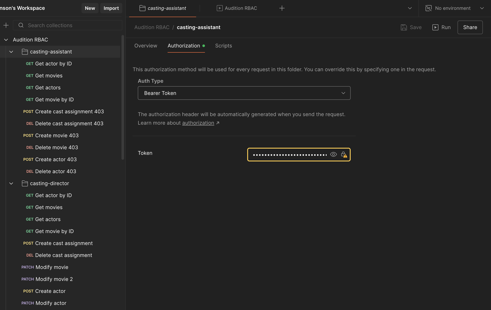
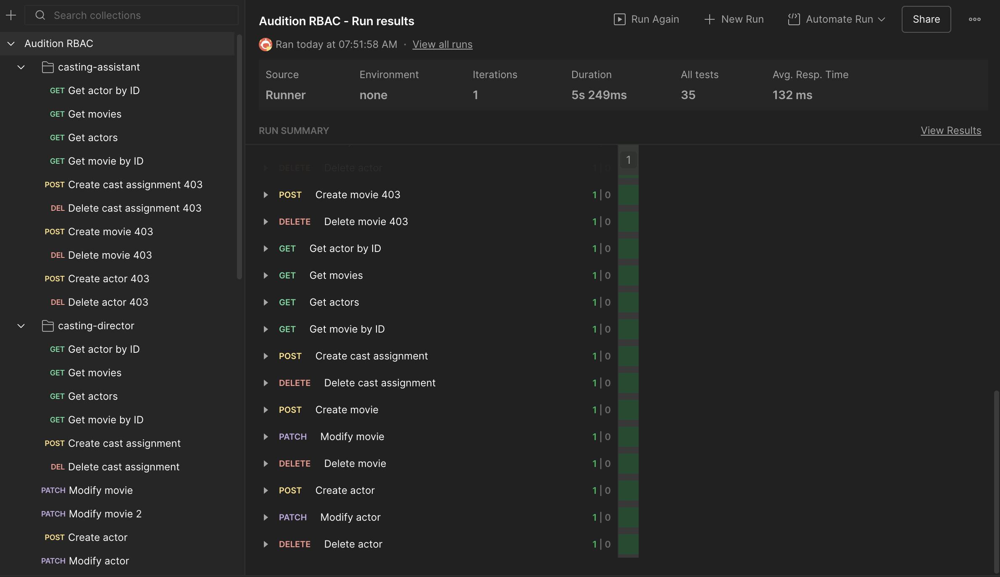

# Python Backend - Udacity Full Stack Developer Nanodegree

This directory contains the backend for the Capstone project.

## Notes
- snake_case is used in the python app, but JSON requests and responses to the API all use camelCase properties for the FE.

## Caveats
Marshmallow Schemas would be a better choice for a larger project, but I made my own validation logic to reduce dependencies.

# To set up a db
- `export DATABASE_URL=postgresql://postgres@localhost:5432/casting`
- `createdb casting`
- `flask db upgrade`

## Setup for local development
- `python3 -m .venv venv`
- `source .venv/bin/activate`
- Create a .env file in `/backend` and provide the values shown below in the .env example.
- `pip install -r requirements.txt`
- `python app.py`

.env Example:
```shell
AUTH0_DOMAIN=YOUR_AUTH0_DOMAIN
ALGORITHMS=YOUR_AUTH0_ALGORITHMS
API_AUDIENCE=YOUR_AUTH0_AUDIENCE
HYDRATE_DB=True # IMPORTANT: Remove this completely (do not use HYDRATE_DB=False) if you do not want
# to hydrate the database, because passing any value here will be interpreted as truthy and
# will cause the app to hydrate a fresh db. This can break migrations if you're not expecting it.
DATABASE_URL=postgresql://postgres@localhost:5432/casting
TEST_DATABASE_URL=postgresql://postgres@localhost:5432/casting_test
ORIGINS=http://localhost:5173 # Or whatever your localhost is.
```

## To run production locally in a container
- `docker build -t capstone . --platform linux/amd64`
- `docker run -e DATABASE_URL=postgresql://postgres@host.docker.internal:5432/casting -e AUTH0_DOMAIN=YOUR_AUTH0_DOMAIN -e ALGORITHMS=YOUR_AUTH0_ALGORITHMS -e API_AUDIENCE=YOUR_AUTH0_AUDIENCE -e HYDRATE_DB=false -e ORIGINS=http://localhost:5173 -t -i -p 8000:8000 capstone`

## Tests
- `createdb casting_test`
- `TEST_DATABASE_URL=postgresql://postgres@localhost:5432/casting_test python -m tests.test_app`

To run an individual test case, use the following command:
`python -m tests.casts_tests`

To create a line-by-line coverage report, run:
`coverage erase && coverage run -m unittest discover && coverage html`

## Postman Tests
A Postman Collection is provided to test all actions on the API for all RBAC Roles (Executive Producer, Casting Director, Casting Assistant). You will need to set up your bearer token for each RBAC Role in the collection by clicking on the role in the collection and then setting the Authentication settings to "Bearer" and pasting in a valid token. Once you have done this for all three roles, and have set a variable for your `baseUrl` you can run the collection without any additional setup required. Here are example screenshots to guide you:


